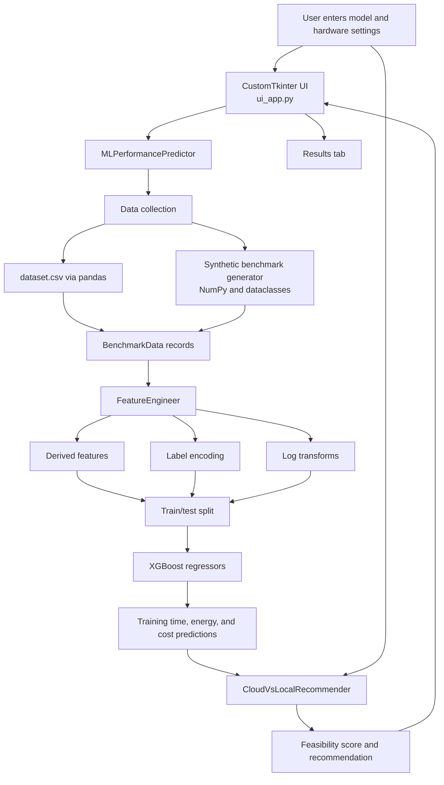

# ML Performance Predictor

An explainable desktop application that estimates machine-learning training time, energy consumption, and cost, then recommends whether a workload should run on local hardware or in the cloud.

The project combines benchmark-style data, feature engineering, supervised regression, hardware feasibility checks, and a CustomTkinter desktop interface.

> **Project status:** This is a working prototype. The benchmark generator and CSV are synthetic/demo data, so predictions should be treated as estimates rather than production capacity planning results.

## What the Application Does

Given a model configuration and local hardware profile, the application:

1. Collects benchmark records from generated MLPerf-style data and an optional CSV file.
2. Converts raw benchmark records into numeric and categorical features.
3. Trains three regression models for:
   - Training time in hours
   - Energy usage in kWh
   - Estimated cost in USD
4. Predicts those metrics for the configured local GPU and an A100 cloud baseline.
5. Scores local feasibility using GPU memory, model size, and hardware capability.
6. Produces a recommendation with confidence, feasibility, cost comparison, timing comparison, and human-readable reasoning.

## Architecture



### Main components

| Component | Responsibility |
|---|---|
| `BenchmarkData` | Typed data structure for one benchmark record. |
| `HardwareSpec` | Stores local GPU, CPU, memory, RAM, storage, and electricity cost. |
| `TrainingRecommendation` | Packages the final recommendation, predictions, scores, and reasoning. |
| `BenchmarkScraper` | Provides MLPerf-style synthetic records. The current implementation does not make a live web request. |
| `DataIngestion` | Reads benchmark rows from CSV using pandas. |
| `FeatureEngineer` | Creates derived numeric features, fills missing numeric values, applies log transforms, and encodes categorical values. |
| `MLPerformancePredictor` | Coordinates data collection, model training, inference, and fallback predictions. |
| `CloudVsLocalRecommender` | Applies feasibility, cost, timing, and hardware rules to choose local or cloud training. |
| `MLPredictorApp` | Provides the desktop workflow: configuration, background initialization, prediction, and results display. |

## Technology Stack

### Python

Python is used for the entire application. It is a practical choice for this project because the data-processing, machine-learning, and desktop UI libraries all have mature Python APIs.

### pandas

Used to load the CSV dataset and represent engineered records as a `DataFrame`. Pandas makes it convenient to select numeric columns, fill missing values, and prepare model input matrices.

### NumPy

Used for numerical operations such as logarithmic transformations, means, random synthetic benchmark values, and safe numeric calculations.

### scikit-learn

Used for the standard machine-learning workflow:

- `train_test_split` creates training and validation subsets.
- `LabelEncoder` converts categorical fields into numeric values.
- `StandardScaler` is initialized for feature scaling, although the current model path does not apply it before XGBoost training.
- `RandomForestRegressor` provides an alternative model type.
- `mean_squared_error` and `r2_score` evaluate each regressor.

### XGBoost

The default model type is `XGBRegressor`. It is used because gradient-boosted trees can model non-linear relationships between model size, FLOPs, batch size, hardware, and performance metrics without requiring feature normalization.

Three independent regressors are trained, one for each target: time, energy, and cost. This is a simple multi-output strategy that lets each target have its own learned function.

### Tkinter and CustomTkinter

Tkinter provides the standard Python desktop GUI foundation. CustomTkinter adds modern themed widgets, dark-mode support, tabs, scrollable frames, buttons, dropdowns, and a more polished visual layer.

### Pillow

Pillow is included as a UI dependency and is imported for image support. The current interface does not use an image asset in its main workflow.

### requests and BeautifulSoup

These libraries are included for a future web-ingestion path. The current `BenchmarkScraper` returns generated synthetic data instead of parsing a live MLPerf page, which makes the demo deterministic in terms of data source availability and avoids depending on a third-party website at startup.

### Python standard library

The project also uses standard modules including:

- `dataclasses` for structured records
- `pathlib` and `os` for filesystem handling
- `threading` for background initialization and prediction
- `logging` for operational messages
- `datetime` for benchmark timestamps
- `typing` for type annotations

## Data and Feature Pipeline

### Input fields

The benchmark records describe:

- Model name and dataset
- GPU and CPU type
- Batch size and epochs
- Dataset size
- Model parameter count
- FLOPs
- GPU memory
- Training time
- Energy usage
- Cost
- Framework and numerical precision
- Timestamp or source metadata

### Engineered features

In addition to the raw numeric values, the feature engineer creates:

- `flops_per_param`: approximate computation per model parameter
- `params_per_batch`: parameter count relative to batch size
- `dataset_batches`: estimated batches per epoch
- `compute_intensity`: FLOPs relative to available memory
- `memory_per_param`: memory relative to model size
- Log-transformed versions of highly skewed values such as model parameters, FLOPs, dataset size, and FLOPs per parameter

Categorical values such as GPU type, framework, precision, and model name are label-encoded. During inference, unseen categories are mapped to an `Unknown` category when possible.

### Targets

The application trains separate regressors for:

```text
training_time -> hours
energy_usage  -> kWh
cost_usd      -> USD
```

Each target uses an 80/20 train/test split with `random_state=42`. The training logs mean squared error and R² for visibility.

## Recommendation Logic

The recommendation is a hybrid of machine-learning predictions and deterministic business rules.

### Local feasibility

The system calculates three scores:

1. **Memory score:** compares estimated memory requirement with local GPU memory.
2. **Complexity score:** classifies the model by parameter count.
3. **Hardware score:** uses a predefined GPU capability map.

The feasibility score is the mean of those three values.

Memory estimation approximates weights, gradients, Adam optimizer state, and activations. FP32 uses four bytes per parameter and FP16 uses two bytes per parameter.

### Local versus cloud comparison

The model predicts local performance using the configured GPU and predicts cloud performance using an A100 with 40 GB of memory. The recommendation then considers:

- Local feasibility
- Estimated local electricity cost
- Estimated cloud cost
- Difference in training time
- GPU capability

The application returns more than a label: it provides confidence, feasibility, predictions for both environments, estimated savings or additional cost, and explanatory reasoning.

## User Interface

The desktop UI contains three tabs:

### Predict Performance

Enter model configuration, dataset size, training settings, framework, and precision. Presets are available for common example models such as ResNet-50, BERT-Large, GPT-2, and ViT-Large.

### Hardware Setup

Configure local GPU type, GPU memory, CPU type, RAM, and electricity price.

### Results

View the recommendation, confidence, feasibility score, local/cloud comparisons, cost savings, and detailed reasoning.

Model initialization and prediction run on background threads so the GUI remains responsive while data is collected and models are trained.

## Project Structure

```text
ML-Predictor-main/
├── complete_predictor.py   # Data, feature engineering, ML models, recommendation engine, CLI flow
├── ui_app.py                # CustomTkinter desktop application
├── dataset.csv              # Synthetic benchmark-style training data
├── requirements_ui.txt      # Pinned Python dependencies
├── run_ui.bat               # Windows launcher and basic startup checks
└── README.md                # Project and interview documentation
```

## Setup

### Prerequisites

- Windows
- Python 3.8 or newer
- A working C/C++ build-compatible environment may be needed by some scientific Python packages if wheels are unavailable

### Install dependencies

From the project directory:

```bash
python -m venv .venv
```

Windows Command Prompt:

```bat
.venv\Scripts\activate
python -m pip install --upgrade pip
python -m pip install -r requirements_ui.txt
```

### Run the desktop UI

```bat
run_ui.bat
```

Or run it directly:

```bash
python ui_app.py
```

### Run the command-line version

```bash
python complete_predictor.py
```

The command-line entry point loads `dataset.csv` when it is available, adds synthetic benchmark records, trains the models, and enters an interactive prompt.

## Important Current Limitations

These are useful points to discuss honestly in a technical interview:

- **Synthetic data:** both the generated benchmark records and the checked-in CSV are synthetic/demo data. Model quality has not been established against real production runs.
- **CSV naming mismatch:** the CSV uses `training_time_hours` and `energy_usage_kwh`, while `DataIngestion` reads `training_time` and `energy_usage`. Those two values therefore fall back to defaults when the CSV is loaded. The schema should be normalized before treating the results as reliable.
- **UI path portability:** `complete_predictor.py` uses the local relative path `dataset.csv`, but `ui_app.py` currently checks a machine-specific absolute path. The UI may therefore skip the checked-in CSV on another computer and use synthetic data only.
- **Feature scaling:** `StandardScaler` is created but not used in the current XGBoost training path.
- **Categorical encoding:** label encoding introduces arbitrary numeric ordering. One-hot encoding or native categorical handling would be more principled for some models.
- **Validation:** one random train/test split is used. Cross-validation, repeated experiments, and a held-out real benchmark set would provide stronger evaluation.
- **Model persistence:** `models/` is created, but trained models are not currently saved or loaded. Every application start retrains the regressors.
- **Cloud assumptions:** the cloud comparison always uses an A100 baseline and approximate pricing rather than a live provider API.
- **Threading:** the UI updates some Tkinter widgets from worker-thread callbacks. A production version should centralize all UI updates on the main event loop.
- **Unused imports:** `pickle`, `joblib`, and some web-scraping imports indicate planned functionality that is not yet active.

## Recommended Next Improvements

1. Normalize and validate the CSV schema with a clear schema adapter.
2. Replace the hard-coded UI path with `Path(__file__).resolve().parent / "dataset.csv"`.
3. Add unit tests for feature creation, unseen categories, memory estimation, and recommendation branches.
4. Add cross-validation and a real benchmark holdout set.
5. Persist models, encoders, feature columns, and metadata with joblib.
6. Add calibrated confidence intervals instead of rule-based confidence values.
7. Add live cloud pricing and hardware telemetry integrations.
8. Use a structured configuration object for model, hardware, and pricing assumptions.

## Interview Summary

### One-minute explanation

“This project predicts ML training time, energy, and cost from benchmark-style workload and hardware features. I built a data pipeline that combines CSV and generated records, engineers computational and memory-related features, encodes categorical fields, and trains three XGBoost regressors. A separate recommendation layer compares predictions for local hardware and an A100 cloud baseline, then combines feasibility rules with cost and time trade-offs. The CustomTkinter desktop UI runs initialization and inference in background threads and presents the recommendation with an explanation rather than only a classification label.”

### Design decisions to be ready to explain

- Why regression is appropriate for time, energy, and cost.
- Why three independent models are used instead of one multi-output model.
- Why derived features such as FLOPs per parameter and dataset batches may improve signal.
- Why the recommendation layer is rule-based instead of asking the regressor to predict “local” or “cloud” directly.
- Why a train/test split and R²/MSE are used, and why stronger validation is needed for production.
- How unseen categorical values are handled at inference time.
- How the UI avoids blocking during model training.
- Which assumptions are prototypes and which parts would need real infrastructure data in production.
## License

No license file is currently included. Add a license before publishing the repository if you want others to reuse or redistribute the code.
